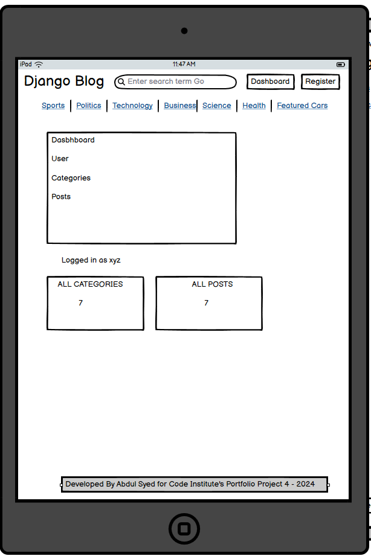
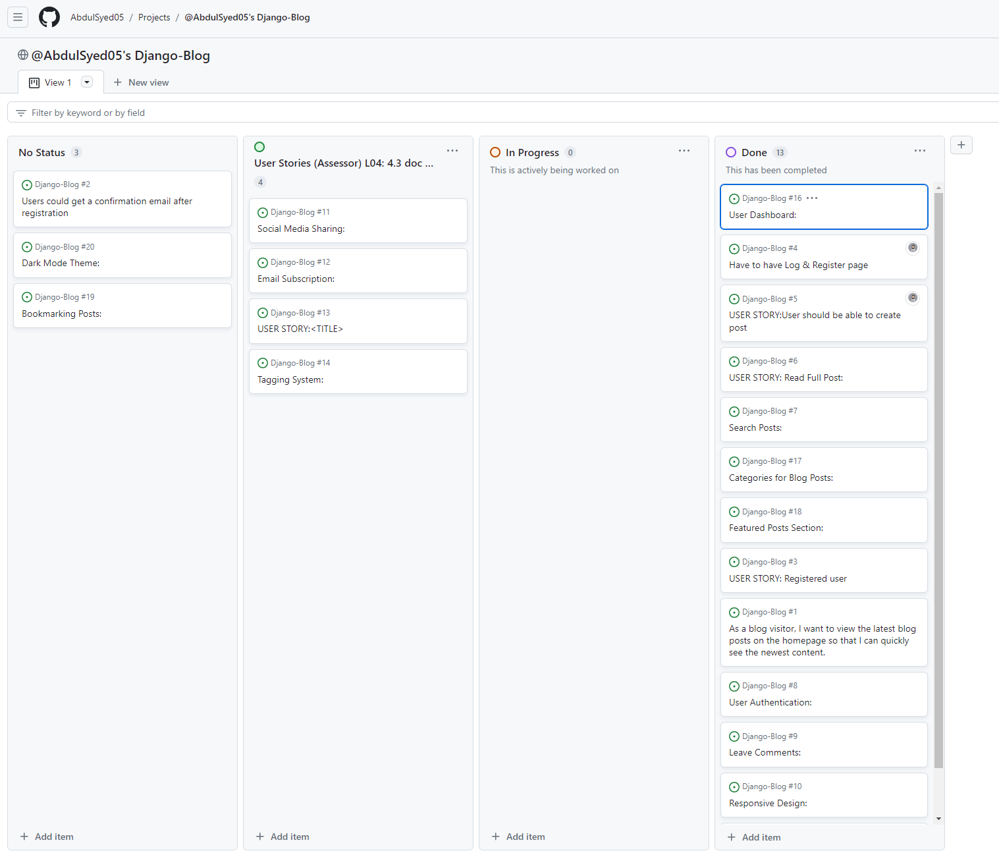
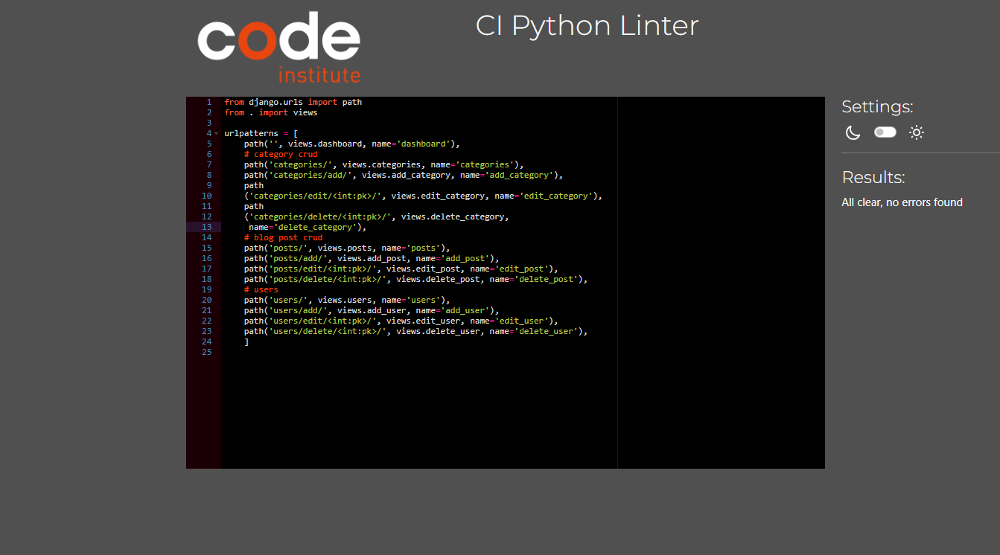

# Django-Blog Portfolio Project 4

## Welcome to the Django Blog App!

🚀 Elevate your blogging experience with our dynamic and user-friendly Django-powered blog platform. Whether you're a content creator or a tech enthusiast, our app empowers you to craft, manage, and share your ideas effortlessly. Dive into the world of modern web development and showcase your content with style. Let's make blogging exciting again! 🌐✨


**[View the live project here.](https://djangobblog-4328bed47b45.herokuapp.com/)**


## Design & Planning: 🔬⚙⚒

### User Stories
First-time Visitor:
- As a first-time visitor, I want to easily understand the purpose of the blog site.
- As a first-time visitor, I want to navigate the site easily and find a list of recent blog posts.
- As a first-time visitor, I want to view individual blog posts with a clear layout and readable content.
- As a first-time visitor, I want the option to sign up for an account to engage more with the site.


#### Registered User:
- As a registered user, I want to log in to my account securely.
- As a registered user, I want a personalized dashboard displaying my profile information.
- As a registered user, I want to create, edit, or delete my own blog posts.
- As a registered user, I want to be able to comment on blog posts and interact with other users.
- As a registered user, I want to customize my profile settings and preferences.


#### Site Owner:
- As a site owner, I want to have administrative access to manage all aspects of the blog.
- As a site owner, I want to be able to create, edit, or delete any blog post on the site.
- As a site owner, I want to have access to user analytics and engagement metrics.
- As a site owner, I want the ability to moderate and manage user comments and interactions.
- As a site owner, I want to customize the overall look and feel of the blog site.

## Features:


## This section outlines the key features and functionalities of the Django Blog app.

### 1. User Authentication

- Users can create accounts, log in, and log out securely.
- Passwords are hashed for security.


### 2. CRUD Operations for Blog Posts

- **Create:** Authors can create new blog posts.
- **Read:** Users can view published blog posts.
- **Update:** Authors can edit and update existing posts.
- **Delete:** Authors can delete posts they created.


### 3. Navigation Bar

- User-friendly navigation bar for easy access to different sections of the app such as Sports, Politics, Technology, Business, Science, Health and Featured Cars.
- Dynamic links to categories, and other relevant pages.


### 4. Sign Up Page

- User-friendly registration page with necessary form fields.


### 5. Categories 

- Organize posts by assigning categories.
- Users can easily filter content based on categories.


### 6. Commenting System

- Readers can leave comments on blog posts.


### 7. Responsive Design

- The app is built with a responsive design, ensuring a seamless experience across devices.

   

### 8. Search Functionality

- Users can search for specific posts using a robust search feature.


### 9. Social Media Integration

- Added Social Media links

   

### 10. Featured Posts

- Highlight a selected post as the "Featured Post" on the homepage.
- Attract attention to specific content or announcements.

   

### 11. Recent Articles

- Display a section showcasing the most recent blog articles.
- Allow users to stay updated on the latest content.


### 12. All Posts

- Displays all posts


### 13. All Users

- Displays all users


### 14. Dashboard

- Displays Dashboard including the categories
- Displays Users, Categories, Posts


### Desktop Wireframes


### Mobile Wireframes


### Tablet Wireframes





## Future Features 🚀
- There are 3 features I would like to implement in the next iteration that would improve user experience and attract more traffic to my website

- Reset password if they forgot
- Send a confirmation email after registering for more security
- Subscribe to our newsletter, So the users are updated


### Agile Methodology

### GitHub Projects

[GitHub Projects](https://github.com/AbdulSyed05/Django-Blog/projects?query=is%3Aopen) served as an Agile tool for this project.

It isn't a specialized tool, but with the right tags and project creation/issue assignments, it was made to work.

Through it, user stories were used to map out the development progress of the project using the basic Kanban board. It helped me to see the backlog of work I needed to complete and move tasks across as I worked on them before testing and signing off to finish them.




### GitHub Issues
[GitHub Issues](https://github.com/AbdulSyed05/Django-Blog/issues) served as an another Agile tool.


### MoSCoW Prioritization

I've decomposed my Epics into stories prior to prioritizing and implementing them.
Using this approach, I was able to apply the MoSCow prioritization and labels to my user stories within the Issues tab.

- **Must Have**: guaranteed to be delivered (*max 60% of stories*)
- **Should Have**: adds significant value, but not vital (*the rest ~20% of stories*)
- **Could Have**: has small impact if left out (*20% of stories*)


### Typography
 
- Fonts used for this project are Playfair Display, Georgia, Times New Roman, serif.

- In selecting 'Playfair Display', Georgia, and 'Times New Roman' as the typography for my project, I aimed to create a balanced and visually appealing design while prioritizing readability and professionalism.

- Playfair Display exudes elegance and sophistication, making it a perfect choice for headlines and titles. Its high contrast letterforms and graceful serifs capture attention and set a refined tone for the project.

- For body text, I opted for Georgia due to its exceptional on-screen readability and classic serif design. Georgia's well-proportioned letterforms and clear serifs ensure comfortable reading experiences across various digital platforms, enhancing the accessibility of the content.

- Finally, Times New Roman serves as a reliable and versatile fallback option, particularly for print materials or when a traditional and formal aesthetic is desired. Its familiarity and widespread use instill a sense of authority and professionalism, making it suitable for conveying information in a clear and authoritative manner.

- Overall, by leveraging the distinct characteristics of 'Playfair Display', Georgia, and 'Times New Roman', all within the serif typography category, I aimed to create a cohesive and visually pleasing design that effectively communicates the project's message while prioritizing readability and aesthetic appeal.

### Colour Scheme


### DataBase Diagram


## Tools & Technologies Used 🧑‍💻
- [HTML](https://en.wikipedia.org/wiki/HTML) was used for the mark up.
- [CSS](https://en.wikipedia.org/wiki/CSS)  was used to style the site.
- [Django](https://www.djangoproject.com/) was the framework that was used.
- [Python](https://en.wikipedia.org/wiki/Python_(programming_language)), django is a python framework.
- [Bootstrap](https://en.wikipedia.org/wiki/Bootstrap_(front-end_framework)) was also used to style the site.
- [JavaScript](https://en.wikipedia.org/wiki/JavaScript) was used for interactiveness.
- [Gitpod](https://www.gitpod.io/about) was used to create this site and then push everything to github.
- [Balsamiq](https://en.wikipedia.org/wiki/Balsamiq) was used to create the wireframes.
- [Heroku](https://en.wikipedia.org/wiki/Heroku) is used to host this site.
- [Github](https://en.wikipedia.org/wiki/GitHub) was used to store the code.
- [Git](https://en.wikipedia.org/wiki/Git) was used for version control.
- [Cloudinary](https://cloudinary.com/) was used to store the images and online static file storage.
- [ElephantSQL](https://www.elephantsql.com/) was used to store the database.
- [Dbsqlite3](https://sqlitebrowser.org/) was also used to store the database.
- [Grammarly](https://app.grammarly.com/) was used to check typography.
- [Gitpod](https://gitpod.io) used as a cloud-based IDE for development.


## Testing Section below:

### Google's Lighthouse Performance
### Desktop


### Mobile


## Browser Compatibility
|  Browser | Links  | Pages  | Responsivnes  | Form fields  |
| ------------ | ------------ | ------------ | ------------ | ------------ |
| Mozila  | Works as expected| Loading pages no issue  |  Responsivness works as expected |  Works as expected |
|  Chrome | Works as expected  |  Loading pages no issue | Responsivness works as expected  | Works as expected  |
|  Edge |  Works as expected | Loading pages no issue  | Responsivness works as expected  |  Works as expected |

### Code Validation

I have only attached 1 Image for HTML validation pages, reason being i have 18 HTML pages. 

### Validated all HTML pages


### Validated all CSS pages


### PEP8 CI Python Linter

### urls.py Blog_main 

### urls.py Dashboard 

### Urls.py Blogs 

### views.py Blog_main 

### views.py Blogs 

### Views.py Dashboard 

### models.py Blogs, As you can see 2 errors E501 Line too long I was able to get rid of the errors but when i did that it was causing Deployment issues because they were split in 2 lines so I had to leave those 2 lines. 


### JavaScript Validation I did not use JS for my PP4, I know there are some files in for JS i really dont understant where they came from. I was using help of my student colleague he ask me to installed AllAuth etc after installing those files JS files are in my project. My main JavaScript files are from Bootstrap. This is not custom JavaScript.

### Manual Testing user stories

### User Registration and Authentication:

- As a new user, I want to be able to register for an account on the blog.
- As a registered user, I want to be able to log in to my account using my credentials.
- As a registered user, I want to receive an error message if I enter incorrect login credentials.
- Creating and Managing Blog Posts:

- As a logged-in user, I want to be able to create a new blog post.
- As a logged-in user, I want to be able to edit my existing blog posts.
- As a logged-in user, I want to be able to delete my blog posts.
- As a logged-in user, I want to see a confirmation prompt before deleting a blog post.
- Viewing and Interacting with Blog Posts:

- As a visitor, I want to be able to view the list of all published blog posts.
- As a visitor, I want to be able to view the details of a specific blog post.
- As a visitor, I want to be able to leave comments on a blog post.
- As a logged-in user, I want to be able to delete comments that I've posted.

### User Profile Management:

- As a logged-in user, I want to be able to view and edit my profile information.
- As a logged-in user, I want to be able to change my password.
- As a logged-in user, I want to receive an error message if I enter an invalid email address while updating my profile.

### Search Functionality:

- As a visitor, I want to be able to search for specific blog posts using keywords.
- As a visitor, I want the search results to be relevant and displayed in an organized manner.


### Manual Testing features

### User Registration and Authentication:

- Verify that new users can successfully register for an account.
- Test user login functionality using valid credentials.
- Attempt to login with invalid credentials it will not let you log in.
- Creating and Managing Blog Posts:

 ### Create a new blog post and verify it appears on the homepage.

- Edit an existing blog post and ensure the changes are saved correctly.
- Delete a blog post and confirm it is removed from the database.
- Test the behavior of the blog post editor, ensuring it supports basic formatting and media embedding.
- Verify that only authenticated users can create, edit, and delete blog posts.

### Viewing and Interacting with Blog Posts:

- Navigate to the homepage and verify that all published blog posts are displayed.
- Click on a blog post title to view its details and confirm the full content is displayed.
- Test the comment functionality by leaving a comment on a blog post.
- Ensure comments are displayed beneath their respective blog posts.
- Test pagination functionality if applicable, ensuring it works correctly for large numbers of blog posts.

### User Profile Management:

- Access the user profile page and verify that the user's information is displayed accurately.
- Test the ability to update user profile information (e.g., username, email, profile picture).
- Attempt to update profile information with invalid data and ensure appropriate error messages are displayed.

### Search Functionality:

- Test the search feature by entering keywords and verifying that relevant blog posts are returned.
- Check for proper handling of edge cases (e.g., empty search queries, non-existent keywords).
- Verify that search results are displayed in a clear and organized manner.

### Security and Permissions:

- Test for CSRF protection on form submissions.
- Verify that unauthorized users cannot access restricted pages or perform restricted actions.
- Check for proper authentication and authorization throughout the application.
- Test for SQL injection vulnerabilities by attempting to inject malicious SQL queries.

### Performance and Scalability:

- Load test the application by simulating a large number of concurrent users.
- Monitor server response times and resource usage during load testing.
- Identify any performance bottlenecks and optimize database queries or code logic as needed.
- Test the application's responsiveness under varying levels of traffic.

### Cross-Browser and Cross-Device Compatibility:

- Test the application's layout and functionality across different web browsers (e.g., Chrome, Firefox, Safari).
- The application is responsive and displays correctly on different devices (e.g., desktop, tablet, mobile).


## Bugs 🐛 

### Bug: Registration Form Allows Duplicate Email Addresses

Description: Users are able to register with the same email address multiple times, causing a conflict in the database.
Fix: Implement a validation check on the registration form to ensure that the email address provided is unique. You can do this by querying the database to see if the email address already exists before allowing the registration to proceed. If the email address is already in use, display an error message prompting the user to choose a different one.

### Bug: Broken Links in Blog Post Content

Description: Some blog posts contain hyperlinks that are not properly formatted, leading to broken links when clicked.
Fix: Implement a function to check the validity of hyperlinks within the blog post content. This function can parse the content and verify that all hyperlinks are properly formatted with the correct syntax. Additionally, you could add error handling to gracefully handle cases where a link is broken or invalid.

### Bug: Comments Not Displaying Properly

Description: Comments submitted by users are not displaying correctly on blog posts or are not being saved to the database.
Fix: Review the code responsible for handling comments submission and retrieval. Ensure that comments are being properly saved to the database with the associated blog post ID. Also, check the template rendering code to ensure that comments are correctly displayed beneath each blog post. Debug any issues with the comment submission form and its validation to ensure that comments are being processed correctly.

### Bug: Unauthorized Access to Admin Panel

Description: Users who should not have access to the Django admin panel are able to log in and access administrative functions.
Fix: Review the user authentication and authorization settings in the Django admin panel. Ensure that only users with the appropriate permissions are granted access to administrative functions. You can do this by configuring user roles and permissions in the Django admin interface or by implementing custom authorization logic in your application code. Double-check the user roles and permissions assigned to each user to ensure that they align with the intended access levels.

### Bug: Incorrect Date Formatting in Blog Posts

Description: The dates displayed on blog posts are formatted incorrectly or inconsistently.
Fix: Review the code responsible for retrieving and formatting dates in your blog post templates. Ensure that dates are being retrieved from the database in the correct format and that they are being displayed consistently across all blog posts. You can use Django's date formatting filters or custom template tags to standardize the date formatting and ensure consistency. Test the date formatting logic with various date formats and edge cases to ensure that it behaves as expected in all scenarios.

### Bug: CSRF Token Validation Failure on Form Submission

Description: When submitting forms, users encounter a CSRF (Cross-Site Request Forgery) token validation failure error message.
Fix: This issue typically arises when the CSRF token included in the form submission does not match the token stored in the session. First, ensure that  is included within your form template. Then, check for any JavaScript code that might interfere with the CSRF token submission or retrieval. Additionally, verify that the middleware classes django.middleware.csrf.CsrfViewMiddleware and django.middleware.csrf.CsrfResponseMiddleware are correctly enabled in your Django settings. If the issue persists, inspect the network requests and responses using browser developer tools to identify any discrepancies in the CSRF token handling process.

### Bug: Session Management Issues Resulting in Incorrect User Sessions

Description: Users experience session-related issues such as being logged out unexpectedly or experiencing data inconsistency across different sessions.
Fix: Review the session management settings in your Django application, including session expiration times, cookie settings, and session backend configuration. Ensure that the SESSION_ENGINE and SESSION_COOKIE_SECURE settings are correctly configured to use a secure session backend and to enforce secure cookie transmission over HTTPS, respectively. Verify that session-related middleware classes such as django.contrib.sessions.middleware.SessionMiddleware are enabled and placed in the correct order in your middleware stack. Additionally, check for any custom session-related logic or third-party packages that might interfere with Django's default session handling behavior. Implement proper error logging and monitoring to track session-related issues and investigate any potential race conditions or concurrency issues that could lead to inconsistent session behavior.


## Deployment 🚀
This website is deployed to Heroku from a GitHub repository, the following steps were taken:

#### Creating Repository on GitHub
- First make sure you are signed into [Github](https://github.com/) and go to the code institutes template, which can be found [here](https://github.com/Code-Institute-Org/gitpod-full-template).
- Then click on **use this template** and select **Create a new repository** from the drop-down. Enter the name for the repository and click **Create repository from template**.
- Once the repository was created, I clicked the green **gitpod** button to create a workspace in gitpod so that I could write the code for the site.

#### Creating an app on Heroku
- After creating the repository on GitHub, head over to [heroku](https://www.heroku.com/) and sign in.
- On the home page, click **New** and **Create new app** from the drop down.
- Give the app a name(this must be unique) and select a **region** I chose **Europe** as I am in Europe, Then click **Create app**.

#### Create a database On ElephantSQL
- Log into the [ElephantSQL](https://www.elephantsql.com/) website and click **Create new Instance**
- Enter a **Name** and keep the plan as **Tiny Turtle Free**, then **tags** field can be left blank, Select a region closest to you, I selected **EU-West-1(Ireland)** as I'm in Ireland. Then click **Review** and afterward click **create an instance**.
- On The Dashboard click on your database instance name.
- You will see the details for your database instance, in the URL section click on the copy icon to copy the database URL.
- Head over to gitpod and create a **Database URL** environment variable in your env.py file and set it equal to the copied URL.

### Cloudinary API

This project uses the [Cloudinary API](https://cloudinary.com) to store media assets online, due to the fact that Heroku doesn't persist this type of data.

To obtain your own Cloudinary API key, create an account and log in.
- For *Primary interest*, you can choose *Programmable Media for image and video API*.
- Optional: *edit your assigned cloud name to something more memorable*.
- On your Cloudinary Dashboard, you can copy your **API Environment Variable**.
- Be sure to remove the `CLOUDINARY_URL=` as part of the API **value**; this is the **key**.


#### Deploying to Heroku.
- Head back over to [heroku](https://www.heroku.com/) and click on your **app** and then go to the **Settings tab**
- On the **settings page** scroll down to the **config vars** section and enter the **DATABASE_URL** which you will set equal to the elephantSQL URL, create **Secret key** this can be anything,
**CLOUDINARY_URL** this will be set to your cloudinary url and finally **Port** which will be set to 8000.
- Then scroll to the top and go to the **deploy tab** and go down to the **Deployment method** section and select **Github** and then sign into your account.
- Below that in the **search for a repository to connect to** search box enter the name of your repository that you created on **GitHub** and click **connect**
- Once it has been connected scroll down to the **Manual Deploy** and click **Deploy branch** when it has deployed you will see a **view app** button below and this will bring you to your newly deployed app.
- Please note that when deploying manually you will have to deploy after each change you make to your repository.

### Local Deployment

This project can be cloned or forked in order to make a local copy on your own system.

For either method, you will need to install any applicable packages found within the *requirements.txt* file.
- `pip3 install -r requirements.txt`.

You will need to create a new file called `env.py` at the root-level,
and include the same environment variables listed above from the Heroku deployment steps.

Sample `env.py` file:

```python
import os

os.environ.setdefault("CLOUDINARY_URL", "insert your own Cloudinary API key here")
os.environ.setdefault("DATABASE_URL", "insert your own ElephantSQL database URL here")
os.environ.setdefault("SECRET_KEY", "this can be any random secret key")

# local environment only (do not include these in production/deployment!)
os.environ.setdefault("DEBUG", "True")
```

Once the project is cloned or forked, in order to run it locally, you'll need to follow these steps:
- Start the Django app: `python3 manage.py runserver`
- Stop the app once it's loaded: `CTRL+C` or `⌘+C` (Mac)
- Make any necessary migrations: `python3 manage.py makemigrations`
- Migrate the data to the database: `python3 manage.py migrate`
- Create a superuser: `python3 manage.py createsuperuser`
- Load fixtures (if applicable): `python3 manage.py loaddata file-name.json` (repeat for each file)
- Everything should be ready now, so run the Django app again: `python3 manage.py runserver`


## Credits 💛
- [Stack Overflow](https://stackoverflow.com/) is probably a developer's best resource, this provided me with many answers to my questions.

- [W3schools](https://www.w3schools.com/) this was great for looking up forgotten **CSS** syntax and how to use it.

- [CodeInstitute](https://learn.codeinstitute.net/) for their walkthrough project, which guided me with website build especially for publishing posts, comments and likes section which I code along with the video with few adjustments.

- [youtube](https://www.youtube.com/channel/UCCezIgC97PvUuR4_gbFUs5g) Corey Schafer 
 videos from **codemy**,  **djangolessons**

- [Allauth](https://django-allauth.readthedocs.io/en/latest/) for their documentation which was helpfull in creating user authentication.

- [Djangoforbeginners](https://djangoforbeginners.com/) for providing useful information abut basic concepts and setup for django.

- [Unsplash](https://unsplash.com/) some images were taken from unsplash and Irish Independet and Irish times news website.

- [Bootstrap](https://getbootstrap.com/) Used Bootstrap theme for my Blog app.


#### Cloning

You can clone the repository by following these steps:

1. Go to the [GitHub repository](https://github.com/AbdulSyed05/Django-Blog) 
2. Locate the Code button above the list of files and click it 
3. Select if you prefer to clone using HTTPS, SSH, or GitHub CLI and click the copy button to copy the URL to your clipboard
4. Open Git Bash or Terminal
5. Change the current working directory to the one where you want the cloned directory
6. In your IDE Terminal, type the following command to clone my repository:
	- `git clone https://github.com/AbdulSyed05/Django-Blog`
7. Press Enter to create your local clone.

Alternatively, if using Gitpod, you can click below to create your own workspace using this repository.

[](https://abdulsyed05-djangoblog-lfjd1qfhcmt.ws-eu108.gitpod.io/)

Please note that in order to directly open the project in Gitpod, you need to have the browser extension installed.
A tutorial on how to do that can be found [here](https://www.gitpod.io/docs/configure/user-settings/browser-extension).

#### Forking

By forking the GitHub Repository, we make a copy of the original repository on our GitHub account to view and/or make changes without affecting the original owner's repository.
You can fork this repository by using the following steps:

1. Log in to GitHub and locate the [GitHub Repository](https://github.com/AbdulSyed05/Django-Blog)
2. At the top of the Repository (not top of page) just above the "Settings" Button on the menu, locate the "Fork" Button.
3. Once clicked, you should now have a copy of the original repository in your own GitHub account!


## Acknowledgment 👏

- I would like to thank Juliaa Konovalova for being my guiding light in the world of Django. Your expertise and encouragement have made this coding journey an incredible experience. I am sincerely grateful for your mentorship .

- I would like to thank Code Institutes Slack Community, and tutor support (Especially Joanne) as this helped me so much when I got stuck on part of my project.

- I would also like to thank our cohort facilitator Marko Tot, for answering any course-related questions I asked and for providing us with weekly guidance information about the project

- I would also like to express my gratitude to my fellow colleagues John, Angus who helped me with debugging, Deployment also for general advices. 

